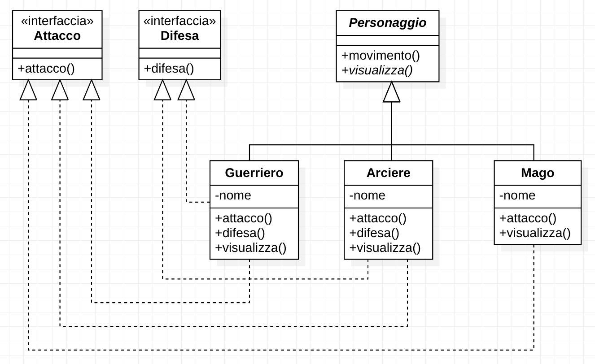

# Strategy Pattern

## Pattern in pratica

Come nasce lo strategy pattern? Per comprenderlo, partiamo da un semplice esmpio applicativo.

Immaginiamo di volere creare una applicazione simile ad un gioco di ruolo.  
La nostra applicazione avrà quindi dei personaggi che combattono tra loro. Ogni personaggio ha il proprio attacco speciale e il proprio mezzo di trasporto per spostarsi nella arena di combattimento.

La prima cosa che ci verrebbe da fare è di creare una superclasse Personaggio, il quale implementerà al suo interno due metodi: Attacco e Movimento. Questi due metodi al loro interno implementeranno quello che poi ogni personaggio dovrà svolgere.  
Dopo di chè estendiamo la superclasse tante sottoclassi quanti sono i personaggi che ci interessa inserire nel nostro gioco.

Quello che otterremmo a questo punto è una cosa del tipo:


Supponiamo ora di volere aggiungere un nuovo metodo ai nostri personaggi, il metodo Difesa. Cosa verrebbe instintivo fare?
Aggiungere un nuovo metodo alla superclasse Personaggio cosicchè ogni nostro personaggio lo erediti da essa.

Questo ultimo passaggio ci recherà tanto lavoro aggiuntivo. Infatti, immaginiamo di avere un terzo personaggio, ad esempio il Mago, che non ha nessuna difesa nel nostro gioco di ruolo. Ciò vorrebbe dire che nel personaggio Mago dovremmo riscrivere il metodo Difesa lasciandolo vuoto, andando così ad eliminare le azioni di difesa per esso.


Questo meccanismo è deleterio al cresciere del nostro gioco. Più personaggi inseriremo, più classi drovremo mantenere, ovvero sarà molto probabile che in molti nuovi personaggi dovremmo modificare singolarmente ogni metodo Attacco, Difesa e Movimento a seconda del personaggio in questione.  
Questa architettura del gioco non è fattibile a lungo andare e soprattutto non permette la riutilizzazione del codice.

Ora, avendo compreso il problema del definire i metodi nella superclasse Personaggio, ci potrebbe venire in mente la seguente soluzione: creare una interfaccia per i metodi Attacco e Difesa per poi implementarle solamente nei personaggi che ne fanno un reale utilizzo, come nel diagramma seguente.



In questa soluzione sorge un secondo problema. Se due personaggi non necessitano di due attacchi differenti, come fanno ad avere l'attacco uguale? Bisogna duplicare il codice, e questa cosa non è buona perchè più c'è codice duplicato, più è difficile la manutenzione, ma soprattutto aumenta il rischio di incorrere in banali errori di scrittura tra le varie implementazioni dello stesso metodo.

Detto tutto ciò, arriviamo alla soluzione definita dallo Strategy Pattern.

Lo Strategy ci dice di dividere il codice che può mutare nel tempo dal codice stabile.  
Questo suggerimento si può applicare molto facilmente al nostro gioco. Infatti abbiamo analizzato cosa cambia e cosa rimane stabile. I metodi Attacco e Difesa sono la parte mutabile del nostro problema. Ogni personaggio può avere un attacco e difesa personale, o in alcuni casi non averli proprio. Questo ci porta a separare i metodi Attacco e Difesa per incapsularli rispettivamente in superclassi astratte, nel caso di Java interfacce.

Se implementiamo tutte le varie implementazioni di attacchi sotto una unica superclasse TipologiaAttacco, il nostro personaggio è in grado di implementare al suo interno una istanza generica della superclasse TipologiaAttacco sul quale chiamare effettivamente il metodo per attaccare. L'istanza generica TipologiaAttacco permette di definire a runtime un qualsiasi attacco che sia sottoclasse di TipologiaAttacco, permettendo così la riusabilità del codice e prevenendo difficili estensione del codice stesso.

Vediamo come si applica lo Strategy Pattern al nostro gioco di ruolo.


Grazie a questa architettura, il nostro gioco è in grado di espandersi in maniera sicura e con uno sforzo davvero minimo.  
Vogliamo aggiungere un personaggio? Bene, ci basta estendere Personaggio e nella sua implementazione specificare quali metodi, come TipologiaAttacco e TipologiaDifesa, vogliamo assegnarli.  
Vogliamo fare una modifica al metodo di attacco SpadaLaser? Perfetto, modifichiamo quello che dobbiamo modificare e tutto d'un tratto ogni personaggio che ne fa utilizzo trova una SpadaLaser già aggiornata.

## Strategy pattern

Ora che abbiamo compreso grazie ad un esempio pratico come si utilizza lo Strategy pattern, proviamo a definirlo in maniera generica, in modo da semplificare il suo riutilizzo.

Possiamo descrivere il pattern come il seguente diagramma.


Questo pattern ci suggerisce tre principi fondamentali:

1. Incapsulare il codice che può variare nel tempo
2. Preferire la composizione all'ereditarietà
3. Programmare un'interfaccia e non un'implementazione

Se proviamo a cercare questi tre punti nel diagramma sopra, è facile notare come sia presente il punto uno, fulcro di questo pattern, il secondo e il terzo punto definisco insieme ciò che varia nel tempo.

Possiamo quindi riassumere lo Strategy Pattern nel seguente modo:

    Definisce un insieme di comportamenti, algoritmi, ogniuno incapsulato e resi intercambiabili. Lo Strategy permette il cambiamento dei comportamenti, algoritmi, senza che il client che ne fa utilizzo necessiti di cambiamenti a sua volta.

## Codice

TipologiaAttacco.java

```java
public interface TipologiaAttacco {
    void attacco();
}
```

TipologiaDifesa.java

```java
public interface TipologiaDifesa {
    void difesa();
}
```

SpadaLaser.java

```java
public class SpadaLaser implements TipologiaAttacco {
    public SpadaLaser() {
    }

    public void attacco() {
        System.out.println("Attacco con la Spada Laser!");
    }
}
```

OndaEnergetica.java

```java
public class OndaEnergetica implements TipologiaAttacco {
    public OndaEnergetica() {
    }

    public void attacco() {
        System.out.println("Attacco con la Onda Energetica!");
    }
}
```

PugnoAllungabile.java

```java
public class PugnoAllungabile implements TipologiaAttacco {
    public PugnoAllungabile() {
    }

    public void attacco() {
        System.out.println("Attacco con il Pugno Allungabile!");
    }
}
```

ScudoVibranio.java

```java
public class ScudoVibranio implements TipologiaDifesa {
    public ScudoVibranio() {
    }

    public void difesa() {
        System.out.println("Difendo con lo Scudo in Vibranio!");
    }
}
```

Ragnatele.java

```java
public class Ragnatele implements TipologiaDifesa {
    public Ragnatele() {
    }

    public void difesa() {
        System.out.println("Difendo con le Ragnatele!");
    }
}
```

Personaggio.java

```java
public abstract class Personaggio {
    protected TipologiaAttacco tipologiaAttacco;
    protected TipologiaDifesa tipologiaDifesa;

    public abstract void visualizza();

    public void movimento() {
        System.out.println("Mi sto muovendo!");
    }
    public void usaAttacco() {
        tipologiaAttacco.attacco();
    }
    public void setAttacco(TipologiaAttacco tipologiaAttacco) {
        this.tipologiaAttacco = tipologiaAttacco;
    }
    public void usaDifesa() {
        tipologiaDifesa.difesa();
    }
    public void setDifesa(TipologiaDifesa tipologiaDifesa) {
        this.tipologiaDifesa = tipologiaDifesa;
    }
}
```

AnakinSkywalker.java

```java
public class AnakinSkywalker extends Personaggio {
    private String nome;

    public AnakinSkywalker() {
        nome = "Anakin Skywalker";
        setAttacco(new SpadaLaser());
        setDifesa(new ScudoVibranio());
    }

    public void visualizza() {
        System.out.println(nome);
    }
}
```

Rubber.java

```java
public class Rubber extends Personaggio {
    private String nome;

    public Rubber() {
        nome = "Rubber";
        setAttacco(new PugnoAllungabile());
        setDifesa(new Ragnatele());
    }

    public void visualizza() {
        System.out.println(nome);
    }
}
```

Gioco.java

```java
public class Gioco {
    public static void main(String[] args) {
        Rubber rubber = new Rubber();
        AnakinSkywalker anakin = new AnakinSkywalker();

        System.out.println("Guerra tra:");
        rubber.visualizza();
        System.out.println("VS");
        anakin.visualizza();
        System.out.println();

        anakin.visualizza();
        anakin.usaAttacco();

        rubber.visualizza();
        rubber.usaDifesa();
        rubber.movimento();
        rubber.usaAttacco();

        anakin.visualizza();
        anakin.setAttacco(new OndaEnergetica());
        anakin.usaAttacco();
    }
}
```