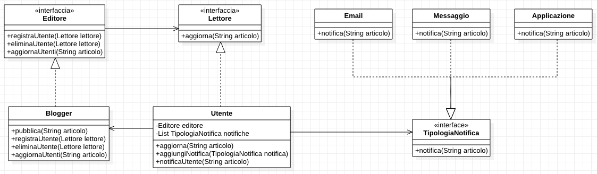

# Observer Pattern

## Pattern in pratica

L'Observer Pattern è uno dei Design Pattern più utilizzati.  
Questo pattern si focalizza sul notificare determinati oggetti al verificarsi di determinati avvenimenti.

Un esempio molto facile per comprendere la forza dell'Observer Pattern è un Blog.

Per questo esempio, immaginiamo di avere un Blog di contenuti generici. In questo blog sono presenti vari editori, i quali hanno la possibilità di scrivere articoli per poi pubblicarli appunto sul blog.  
Gli editori hanno la necessità che il Blog notifichi tempestivamente gli utenti registrati alla loro rubrica ogni volta che venga pubblicato un articolo, in modo che più utenti lo possano leggere immediatamente.  
Un utente può registrarsi in quante più rubriche esso voglia rimanere aggiornato.

Questa applicazione molto comune e pratica può essere risolta completamente grazie al pattern Observer.

L'Observer si compone di due interfaccie:

- Il Soggetto che notificherà i cambiamenti
- L'Osservatore che attende di essere aggiornato

L'interfaccia Soggetto contiene al suo interno una dipendenza dall'interfaccia Osservatore. Infatti il Soggetto deve tenere internamente una lista con tutti gli Osservatori che dovranno essere notificati. Nella nostra applicazione il soggetto lo chiameremo Editore, mentre l'osservatore lo chiameremo Lettore.  
Le implementazioni dell'Editore e Lettore sono rispettivamente i nostri attori Blogger e Utente. Il blogger dovrà notificare l'utente.  
Avremo quindi un diagramma di questo tipo.


Questo diagramma illustrato è proprio il pattern Observer.  
Detto ciò l'applicazione Blog potrebbe essere già conclusa, ma dato che abbiamo appena visto il pattern Strategy, possiamo implementare diverse tipologie di notifiche per l'utente. Infatti possiamo immaginare che un utente utilizzi l'applicazione del Blog per leggere gli articoli, mentre altri vengono informati tramite email o messaggio.

L'implementazione del metodo di notifica è molto semplice, basta inserire nell'Utente un attributo TipologiaNotifica che permetterà di utilizzare qualsiasi notifica che sia sottoclasse di essa.

Il nostro Blog completo avrà quindi un diagramma di questo tipo.



## Observer pattern

Il pattern Observer è un pattern molto pratico, il quale ha più vantaggi all'atto pratico che teorico.  
Diamo quindi un'immagine al seguente pattern con attori generici.


Una piccola curiosità riguardo l'Observer Pattern.  
Questo pattern è implementato nativamente in Java, le rispettive librerie sono ```java.util.Observable``` e ```java.util.Observer```.

L'implementazione di questo pattern in Java è leggermente differente rispetto a quanto detto fino ad adesso. Infatti quello che noi chiamiamo Soggetto, definito come una interfaccia, in Java è una classe concreta. Questo ci porta un pò di problemi. Come prima cosa, dal pattern Strategy abbiamo imparato che è meglio programmare una interfaccia piuttosto che una implementazione, il chè permette maggiore riutilizzo del codice. Come seconda cosa, l'implementazione di Observable dovrà estendere la classe Observable, impedendo così la possibilità di alterare il comportamento dei metodi.  
In ogni caso, il pattern nativo in Java non viene quasi più utilizzato. Solitamente, data la elevata semplicità, si costruisce personalmente il pattern all'occorrenza.

Questo diagramma raffigura il pattern Observer implementato in Java.


Concludiamo elencando il principio fondamentale che aggiunge il pattern Observer ai principi già visti nel precedente pattern:

1. Incapsulare il codice che può variare nel tempo
2. Preferire la composizione all'ereditarietà
3. Programmare un'interfaccia e non un'implementazione
4. Creare design liberamente accoppiati tra oggetti che interagiscono

Questo nuovo principio è il punto fondamentale dell'Observer. Infatti in questo design gli oggetti che interagiscono tra loro non si conoscono, nessuno dei due sa qualcosa dell'altro. L'unica conoscenza in comune è il metodo ```update```, il resto dell'implementazione degli oggetti non risulta importante al fine del seguente design.

Concludiamo con una massima riguardo il pattern Observer.

    Definisce una dipendenza Uno-A-Molti tra gli oggetti in modo che quando un oggetto cambia stato, tutti gli oggetti dipendenti da esso vengono notificati e di conseguenza aggiornano lo stato corrente automaticamente.

## Codice

Editore.java

```java
public interface Editore {
    void registraUtente(Lettore osservatore);
    void eliminaUtente(Lettore osservatore);
    void aggiornaUtenti(String articolo);
}
```

Lettore.java

```java
public interface Lettore {
    void aggiorna(String articolo);
}
```

Blogger.java

```java
import java.util.ArrayList;

public class Blogger implements Editore {
    private ArrayList<Lettore> lettori;
    
    public Blogger() {
        lettori = new ArrayList<Lettore>();
    }

    public void pubblica(String articolo) {
        aggiornaUtenti(articolo);
    }

    public void registraUtente(Lettore lettore) {
        lettori.add(lettore);
    }

    public void eliminaUtente(Lettore lettore) {
        if (!lettori.contains(lettore))
            lettori.add(lettore);
    }

    public void aggiornaUtenti(String articolo) {
        for (Lettore lettore : lettori)
            lettore.aggiorna(articolo);
    }
}
```

Utente.java

```java
import java.util.ArrayList;

public class Utente implements Lettore {
    private String username;
    private String articolo;

    private ArrayList<TipologiaNotifica> notifiche;

    public Utente(String username) {
        this.username = username;
        notifiche = new ArrayList<TipologiaNotifica>();
    }

    public void aggiungiBlogger(Editore editore) {
        editore.registraUtente(this);
    }

    public void eliminaBlogger(Editore editore) {
        editore.eliminaUtente(this);
    }

    public void aggiorna(String articolo) {
        this.articolo = articolo;
        notificaUtente();
    }

    public void aggiungiNotifica(TipologiaNotifica notifica) {
        notifiche.add(notifica);
    }

    public void notificaUtente() {
        for (TipologiaNotifica notifica : notifiche) {
            System.out.println();
            System.out.println("Notifico l'utente " + username);
            notifica.notifica(articolo);
        }
    }
}
```

TipologiaNotifica.java

```java
public interface TipologiaNotifica {
    void notifica(String articolo);
}
```

Email.java

```java
public class Email implements TipologiaNotifica {
    public Email() {
    }

    public void notifica(String articolo) {
        System.out.println("Notifica tramite email del seguente articolo:");
        System.out.println(articolo);
    }
}
```

Messaggio.java

```java
public class Messaggio implements TipologiaNotifica {
    public Messaggio() {
    }

    public void notifica(String articolo) {
        System.out.println("Notifica tramite messaggio del seguente articolo:");
        System.out.println(articolo);
    }
}
```

Applicazione.java

```java
public class Applicazione implements TipologiaNotifica {
    public Applicazione() {
    }

    public void notifica(String articolo) {
        System.out.println("Notifica tramite applicazione del seguente articolo:");
        System.out.println(articolo);
    }
}
```

Blog.java

```java
public class Blog {
    public static void main(String[] args) {
        Blogger techCrunch = new Blogger();
        Blogger wired = new Blogger();

        Utente antonio = new Utente("Antonio");
        Utente giuseppe = new Utente("Giuseppe");
        Utente viola = new Utente("Viola");
        Utente leonardo = new Utente("Leonardo");
        Utente gioia = new Utente("Gioia");

        antonio.aggiungiBlogger(techCrunch);
        giuseppe.aggiungiBlogger(techCrunch);
        viola.aggiungiBlogger(techCrunch);
        viola.aggiungiBlogger(wired);
        leonardo.aggiungiBlogger(wired);
        gioia.aggiungiBlogger(wired);

        antonio.aggiungiNotifica(new Email());
        antonio.aggiungiNotifica(new Messaggio());
        viola.aggiungiNotifica(new Applicazione());
        leonardo.aggiungiNotifica(new Applicazione());
        leonardo.aggiungiNotifica(new Email());
        leonardo.aggiungiNotifica(new Messaggio());

        String articoloTechCrunch = "Articolo TechCrunch";
        String articoloWired = "Articolo Wired";

        techCrunch.aggiornaUtenti(articoloTechCrunch);
        wired.aggiornaUtenti(articoloWired);
    }
}
```
